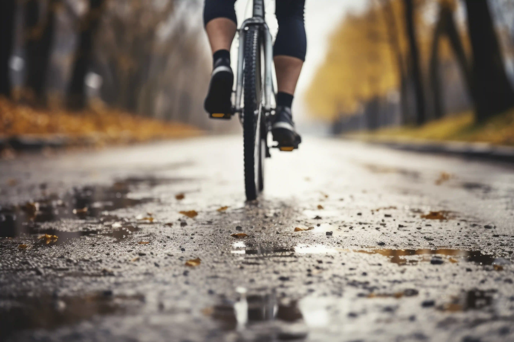

## Ride for everyone …

The cycle grades will allow you to understand what sort of ride you are looking at with the information necessary, to choose the perfect tour for you. Keep in mind that the grades are somewhat subjective!

The weather conditions and altitude are not considered for the difficulty rating.

### The grades are based on various elements influencing the cycling level and the difficulty :

- Total distance
- Elevation gain
- Route profile
- Terrain
- Technical difficulty
- Physical difficulty
- Cycling days

To join the cycling holidays, ensure you have good physical fitness, cycle regularly, and shift gears well when climbing and descending is a requirement for cycling pleasure.

On some of our cycling tours in mountainous areas, we include e-bikes, which allow us to cross the demanding terrain.

We consider an E-bike a regular bicycle with the same cycle grades. Riding an electric bike does not require any previous experience.

Below are the trail grades for Tour, Road, and Mountain bike. 

- <a href="/cycle-grades-tour-bike.pdf" target="_blank">Cycle Grades Tour Bike </a>
- <a href="/cycle-grades-road-bike.pdf" target="_blank">Cycle Grades Road bike </a>
- <a href="/cycle-grades-mountain-bike.pdf" target="_blank">Cycle Grades Mountain bike </a>
