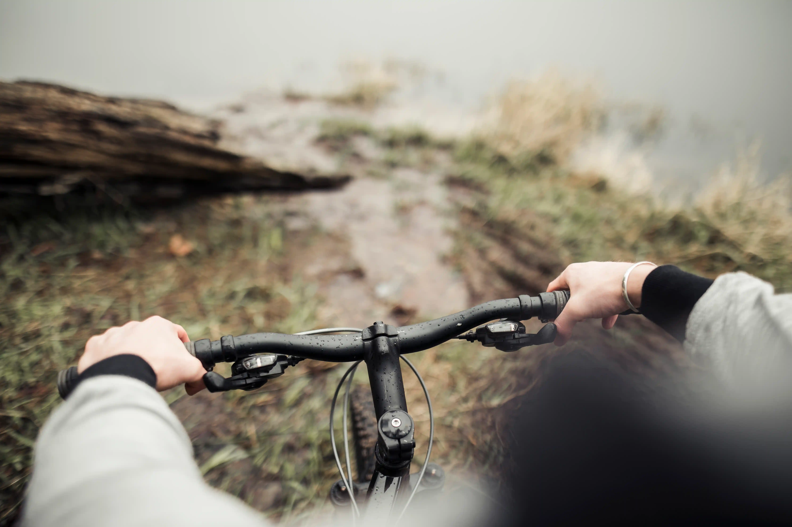

We provide high-quality bicycles from Full Carbon Road Bikes to E-Mountain Bikes, Trekking Bikes, Gravel Bikes, and Mountain Bikes Full Carbon.

The bicycles are equipped with panniers during multi-day cycle tours, allowing the bike to take the weight rather than your shoulders.

When booking, you indicate your height and weight to have the correct frame size of the bicycle at the start of your tour.

We facilitate fitting your pedals or saddle if you wish to bring them.

We provide spare parts and take care of the day-to-day maintenance during multi-day tours.

### Components of our Road Bicycles:

- Shimano Ultegra or Shimano 105
- Crankset: 34-50
- Cassette: 11-30 & 11-32 (for harder climbs)
- Type of pedals: Look Keo, SPD, or SPD SL (let us know if you need other pedals)

### Check our range of bicycles:

- BIANCHI, COLUER, and WRC Road Bikes
- TREK and WRC MTB
- CORRATEC Gravel Bikes
- BERGAMONT E-Mountain Bike
- CORRATEC Trekking Bike

#### Below you find more info about the bicycles. 

<a href="/our-bicycle-selection.pdf" target="_blank">Our Bicycle Selection </a>
