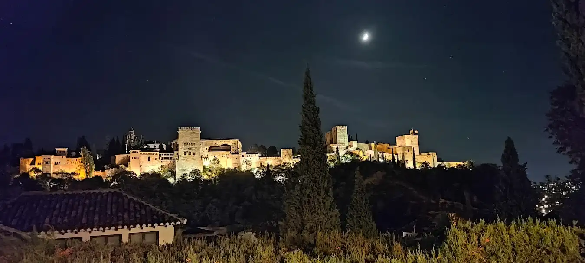

Sun and snow, land and sea, history and legend—Granada has so much to offer, from the mythical city that witnessed the fall of the last King of Moorish Al-Andalus to pristine natural areas. The land that charmed romantic travelers still bewitches anybody who visits it.

Granada's province lies southeast of Andalusia and has been the bridge between the Orient and the West since immemorial. The historical and artistic heritage of Granada, the ancient capital of the Nasrid Kingdom, is a crossroad of cultures that settled in its villages and towns.

Granada the last capital of the Moorish Al-Andalus reveals places and monuments filled with history and tells us about a wealthy past marked by the eight centuries of Islamic presence. These memories are visible in the narrow streets of the Moorish quarter, Albayzín, and the Alhambra, the pride of the Nasrid kings in the city of Granada.

The Alhambra, the Generalife, and the Albayzín have been declared a World Heritage Site by UNESCO. However, they are only a sample of the enormous monumental wealth of Granada which offers its visitors anything from Arab baths, Muslim fortresses, castles, and towers to monumental temples and Gothic, Renaissance, or Baroque constructions.

The interior of the province conceals charming places to visit. Alpujarra y Valle de Lecrín, the Poniente Granadino, the areas of Guadix y El Marquesado, and the Altiplano de Granada: Baza y Huéscar have managed to preserve their essence throughout history. Time seems to have stopped in these villages with traditions transmitted from parents to children, in a way that takes the visitor back to the past.

At the sea, Motril, Salobreña, and Almuñécar are the most popular destinations on the Costa Tropical. They are surrounded by an orchard of tropical crops and a unique subtropical climate in the Peninsula, with an average temperature of 20ºC.

Snow, Europe’s southernmost ski resort, the Sierra Nevada, attracts thousands of people every year who enjoy the highest summit of mainland Spain and its spectacular views as far as the African coast.

Join us and see everything that Granada has to offer from a beautiful Andalusian city to a great diversity of protected natural areas. Great for a family trip, with your partner, with friends, or alone. From cultural tours to active travelers with mountains and excursions is possible to fully experience the province of Granada. 

