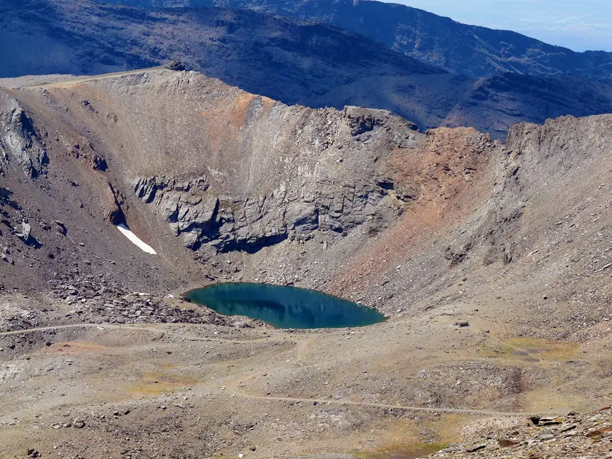
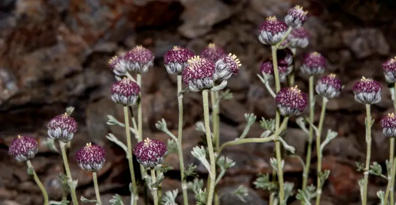
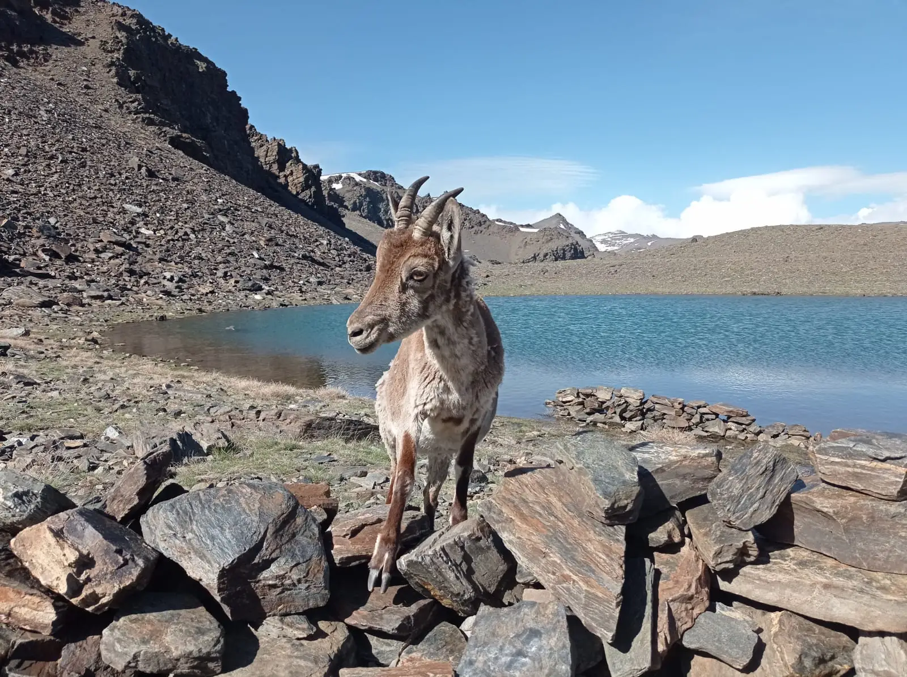

### Location

The Sierra Nevada extends over a range of 2.000 km² through the regions of Granada and Almería. It measures 78 km from east to west and ranges from 15 km wide at its eastern border to 30 km wide at the western border. The edge of the west borders the Vega of Granada and the Valley of Lecrín, the eastern, province of Almería. The Marquesado of Zenete constitutes the northern border and the Alpujarra mountain range, the southern.

### The Mountain Range

The Sierra Nevada represents the highest massif in Europe, after the Alps. Approximately one-fifth of its peaks are higher than 3.000 m. The 4.482 m of the Mulhacén peak renders it the highest on the Iberian Peninsula (located only 33 km from the Mediterranean coast). Other peaks of note are: Cerro de Caballo (3.005m), Veleta (3.394m), Machos (3.329m), Alcazaba (3.371m), and Picón de Jerez (3.090m). Along the ridge that separates the Marquesado of Zenete from the Alpujarras, the major peaks include: San Juan (2.786m), Chullo (2.608m), and the Cerro of Almirez (2.519m).

### Orography

The upper reaches of the Sierra Nevada form a longitudinal division between the northern and southern parts. The southern slopes are characterized by smooth, voluminous, extensive flanks billowing down to the Alpujarras; by contrast, precipitous inclines mark the northern slopes. The highest peaks are found in the west, while the eastern range descends gradually towards the Tabernas desert.

### Formation

The Sierra Nevada is part of the Cordilleras Beticas, which formed during the Alpine folding of the tertiary era (300 million years ago), through the movement and collision of the African plate against the Central Iberian Massif (a movement that is continuing). It is a young mountain range, about the same age as the Himalayas and the Alps, and is still growing (0.5 mm/year).

The peaks (the Complejo Nevado Filabride) are composed of metamorphic rocks (micasquite, quartzite, and gneiss). The Complejo Alpujarride is to be found just below the highest zones. It is principally formed of limestone and dolomite.

### Climate

The climate is classified as Mediterranean, due to a dry period of at least two months during the summer. However, the microclimates in the Sierra Nevada range from dry through semi-dry and semi-wet to wet. The higher areas consist of cold deserts (although not tundra) whilst a Mediterranean mesoclimate can be found on the southern slopes.

The absence of trees on the higher slopes is due to two factors: the intense cold of winter and the lack of water in the summer, this latter factor being characterized of the Mediterranean climate.

In the western and central zones, precipitation generally originates from Atlantic cyclonic fronts. However, the southern, or sunny, slopes are more affected by low-pressure fronts from the Mediterranean. Weather fronts from both sides affect the higher parts of the mountains. There is a notable difference in temperatures between the southern slopes, warmed by the Mediterranean Sea, and the northern, which tend to be much colder. Every 300 meters of ascent entails a drop in temperature of approximately 1 degree. Therefore, any rainfall above 1.800 m becomes snow on at least 30% of occasions, and above 2.500 meters on about 95% of occasions, an additional point to note is that it is not uncommon for weather fronts from the Sahara to deposit red snow.

Temperatures oscillate to a large extent between the maxima of the days and the minima of the night. Summers are short with mild temperatures, although strong sunshine. In winter the temperatures can descend to 15ºC below zero, and more than occasionally the wind reaches speeds of over 100 km/hr.

### Glacial Remains

A blanket of snow is a typical consequence of the high altitude of the mountains. The first snowfall occurs towards the end of October, leaving the slopes covered until May when the thaw begins. By August and September almost all of the snow will have disappeared, leaving isolated patches of snow on the northern slopes.

During at least one or two of the ice ages of the Quaternary period, a few modest glaciers formed on the summits from the Cerro del Caballo to the Cerro de Trevélez. These glaciers have left their mark through various formations, such as cirques (Circo del Mulhacén), small lakes (Laguna Larga), ridges (Crestones and Raspones de Río Seco), and moraines (Corral del Veleta).

These days there are no dynamic glaciers, although periglaciers continue to be active above about 2.500 meters.

### Lakes

The locations which formerly featured glaciers are today lakes. Not all of the lakes are permanent, the existence of some of them depends on the rainfall during the year. The Embalse de las Yeguas, of glacial origin, forms part of the source of the River Dílar and was converted into an artificial reservoir in 1976.

### Flora

The botanical biodiversity of the Sierra Nevada is of incalculable value as much for its unusual wealth as for the knowledge on a popular level of the small jewels to be found in these mountains. A census has charted 2.100 plants. This amounts to almost 30% of the floral population of the Spanish Peninsular, occupying only 0.4% of its extent. Latest figures reveal 86 exclusive endemic species.

Five factors can be cited that have led to such a considerable number of species: the existence of various geological substrates, the high altitude, the complex geological history, the accumulation of flora of distinct origins, and the isolation of the area from the surrounding systems.

Dating back to the end of the tertiary period, the ancient gymnosperms include: junipers, savines, yews, black pines, and alepo pines. Of African origin (the late tertiary period) are the prickly Anthyllis, the Vella spinosa, and various gorses.

The white pine arrived during the quaternary period in the glacier-formation ice age. During the quaternary glaciations, many northern, arctic, and alpine species took root in the Sierra Nevada, moving south to escape the lethal freezes of the north.

At the end of the glaciations, these plants couldn’t find any suitable similar conditions nearby. Isolated, they formed magnificent endemic species that have survived through to today, such as the star of the Snow “Plantago Nivalis” and Royal Camomile “Artemisia Granatensis”.

The Atlantic climate (mild and wet) brought the Pyrenean oak woods to the Sierra Nevada. More recently, other species such as the Hyssop (Hyssopus Officinalis), introduced during the Arab era, have found ideal conditions here, as have the plants from South America and South Africa being introduced today.

A further ecosystem is in play in the Borreguiles. This area, situated at the base of various valleys and cirques carved out by the quaternary glaciers, remains moist all year round. It is renowned for the number of fragile, endemic species to be found.

The Sierra Nevada is covered with wild mushrooms, particularly in autumn. They can be found in any part, although their distribution is affected by the rains. It is worth recognizing the different species as many of them are poisonous.

There are several plants with medical properties. Knowledge of their efficacy has been passed down by the inhabitants of the Sierra Nevada over the years and they are still used as a form of alternative medicine.

The visitor is responsible for not causing the extinction of any further species. There is a large number of plant species in serious danger of disappearing.

They are there to be enjoyed with all the senses, but should not be picked.

### Fauna

The Sierra Nevada is home to at least one hundred endemic species, although the enormous biodiversity of the region means that many probably remain unknown. Varies species have become extinct, some of these still live in other Andalusian Mountain ranges such as the wolf, otter, vulture, and lammergeier.

Further species which are threatened with extinction include butterflies and grasshoppers.

Birds: Blue rock thrush and red-billed choughs can be found in the highest parts of the mountains. Pairs of golden eagles nest in the Alpujarras. Vultures from other nearby ranges can be seen here from time to time. Kestrels and nocturnal birds of prey exist in abundance. Partridges, turtledoves, doves, and thrushes abound, as to the smaller species: coal tits, wrens, wagtails, goldfinches, bee-eaters, kingfishers, and dippers. Goshawks, sparrowhawks, and booted eagles can be found.

Mammals: The Spanish Ibex, endemic to the Iberian Peninsula, stands out for its abundance, the Sierra Nevada being home to the largest population in Spain. There is a proliferation of wild boar and foxes. Also to be found are civet cats, weasels, badgers, moles, and even wild cats, although these are harder to spot.

Reptiles: Be especially wary of the snouted viper, which lives among the fields and waterfalls at about 2.000 – 2.500 meters of altitude. Large spotted lizards are also in evidence.

Arthropods: These are the most abundant and varied species. Some are endemic ones, such as the grasshopper or the rhinoceros beetle (not endemic, but very rare and protected in other European countries).

The greatest riches are probably to be found amongst the butterfly species. The brightly colored ones such as the “Parnassius Apollo Nevadensis” or the “Minute Plebicula Goigus” with its shades of blue are of particular note.

Common trout and rainbow trout live in these rivers.

