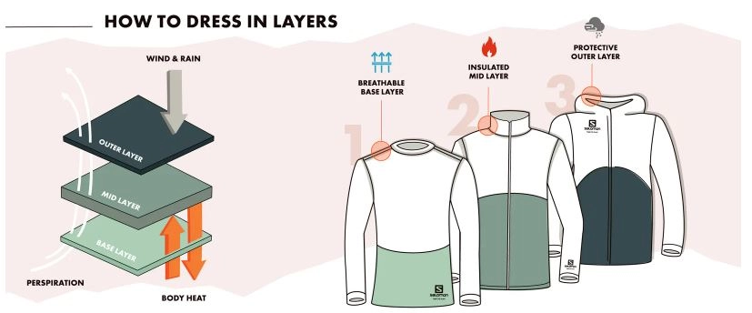
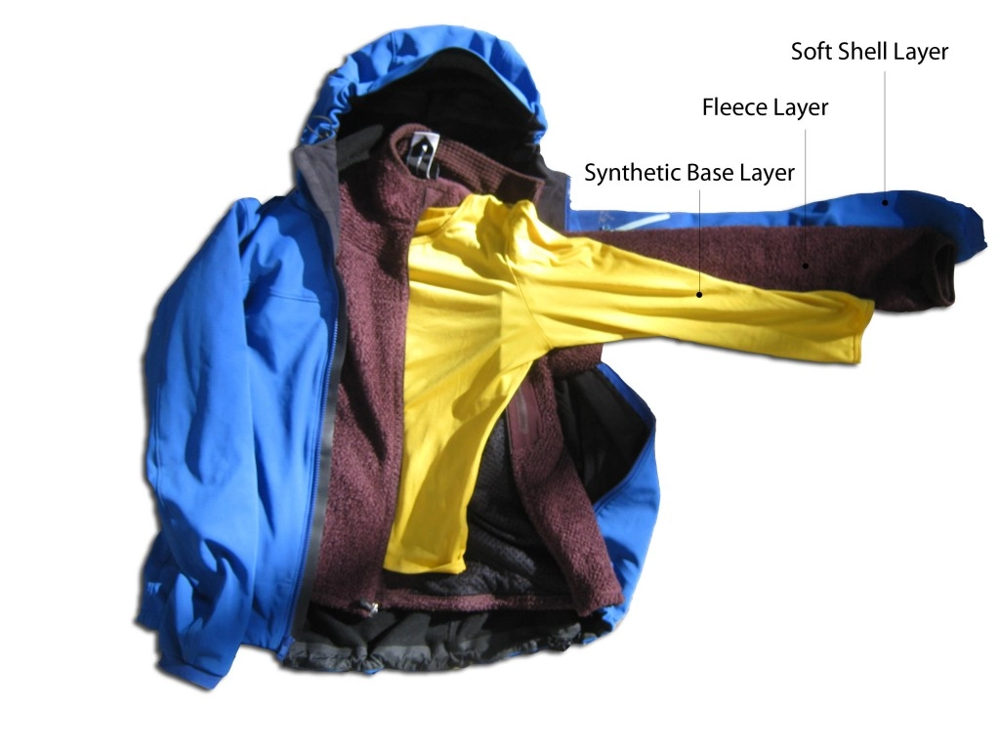

## How to properly dress in layers with the three-layer system

When practicing outdoor sports, you need to protect yourself from the elements (rain, wind, snow, cold temperatures, etc.) by managing your perspiration.

The three-layer system helps you choose the right clothes while taking into account the weather conditions and the sport you are practicing. Three layers of clothing will keep you dry and warm: a base layer for removing moisture, a mid-layer to keep you warm, and an outer layer to protect you from the elements.

### Breathable base layer for wicking away moisture

When we exert ourselves our body temperature increases. To prevent overheating, our body's response is to perspire. The evaporation of sweat on the surface of our skin cools our body down. When sweat comes into contact with the air, which is usually colder, the vapor condenses and turns into water on the skin's surface. A wet t-shirt, especially if it is made from an absorbent material like cotton, will make you feel cold as soon as you stop exercising due to the moisture that stays in contact with your skin.

The aim of a base layer worn next to your skin is to wick sweat away so that you stay dry. When practicing sports you need a base layer that removes moisture, so forget the famous cotton t-shirt which is very absorbent and takes a long time to dry!

Synthetic materials like polyester or polyamide are water-resistant: they don't absorb water. Any moisture moves toward the outside of the clothing so it isn't in contact with your skin. Wearing a t-shirt made from a synthetic material allows your body to regulate its temperature without feeling cold. These materials also dry very quickly. There are also base layers that are made from merino wool. Wool can absorb up to 33% of its weight in water, so why do we use it as a base layer? This absorbent material prevents perspiration from staying in contact with your skin and even wet wool is a good insulator. Lastly, wool prevents odors from developing so you don't have to wash your merino clothes after each wear. Base layers made from merino wool are, therefore, particularly useful for low-intensity exercise. Some materials are a mix of synthetic fibers and wool. They allow you to make the most of their respective qualities combined in one outfit.

### General rule, never wear cotton outdoors.

Cotton is a globally rejected material by outdoor enthusiasts. Cotton is a material that aggressively traps moisture, increasing heat loss through evaporation.

### Why shouldn't you wear cotton outdoors?

A useful experiment. On a rainy day, do the following: Put on your regular (non-waterproof) sneakers and go for a walk in the rain. On one foot you should wear a regular cotton sock and on the other a merino wool outdoor sock. The result of the experiment:

"Within a few seconds of your shoes and socks becoming saturated, you will notice that both feet immediately become cold and uncomfortable. Be strong. Keep walking. Within 10 minutes, you will notice that the foot with the wool sock begins to feel warmer and more comfortable. The cotton sock will still feel very cold. Over time, the foot soaked in wool will feel fine, like you could walk around in that wet wool sock for several more hours, while the cotton-covered foot will feel like it's about to freeze. Then, go home, dry off, and warm up. Wring out the wet socks and hang them close to each other. Check them every hour to observe their drying times. The wool sock should be almost dry in about 2-3 hours, depending on its thickness, temperature, and humidity. The cotton sock will take considerably longer."

### Insulating mid-layers to keep you warm

A mid-layer will protect you from the cold by conserving the heat generated by your body.

The ability of the fibers to keep the air locked in is what makes it an insulating layer. The more air it locks in, the more your clothes will maintain your body heat.

Adapt your mid-layer to your warmth requirements:

- High outside temperatures or sustained exercise: in these conditions, you can go without a mid-layer. However, remember to put a warm layer in your backpack to use if you stop and get cold or if there is a change in the weather.
- Cool weather conditions: a fleece is ideal as it combines warmth with good moisture removal qualities. Light, synthetic insulated jackets are also useful as they will keep you warm, compress down easily, and are easy to clean.
- Cold or glacial conditions: Thick-down jackets are excellent mid-layers in really cold conditions. This type of jacket is lightweight and can be compressed down (useful when you need to get it in your backpack). On the other hand, if duck down gets wet, it clumps together and it loses its insulating qualities.

These jackets shouldn't be used in wet weather or when you are likely to sweat a lot. You also need to be careful when washing your down jacket to ensure it keeps its shape.

If you wear a mid-layer that insulates too much, you are going to be too hot and sweat a lot. When wet, your mid-layer will lose its insulating qualities and all the accumulated moisture will increase the feeling of cold.

### Waterproof or shielding outer layer to protect you from the elements

When protecting ourselves against the elements, we immediately think of Gore-Tex jackets, yet there are other brands of waterproof and breathable membranes. If you want to compare their waterproofness, there is a water column test (Schmerber rating) that measures (in millimeters) the resistance of the fabric to water pressure. For example, Gore-Tex jackets have a rating of 28000 Schmerber.

Waterproof clothing also has waterproof seams.

Membrane breathability is measured in g/m2/24 hours or, for the Gore-Tex brand, the RET value is used (measurement of the resistance to evaporative heat loss). The more breathable the fabric, the more suited it is to high-intensity exercise.

Some jackets have zippered vents to improve perspiration removal.

For extra protection against the wind, while remaining breathable, some clothes are made from the 'Windstopper' membrane.

Water-repellent clothing, also called softshell, is very flexible and feels nice to wear.  It is breathable, so sweat is removed when you exert yourself. If the weather conditions deteriorate, the water-repellent treatment on the outer shell of the material, or in some cases on all of the membrane, will be enough to protect you from light rain or a quick rain or snow shower.

### Adapt your layering to the weather conditions

The layering system encourages the removal of perspiration as well as protection from the elements.  It can accommodate all eventualities. On the same day, the weather conditions, or your requirements can change (a drop-in exercise intensity, deterioration of weather conditions, change in altitude).

Remember to adjust your layers taking into account all of these factors, and be prepared by making sure you take everything you'll need in your bag.

### No mid-layer for trail running in hot weather

When it's hot, you will only need to remove perspiration. Just a technical base layer will be suitable. An outer layer may be necessary to protect you from the rain, but you can go without the mid-layer as you won't need warmth.

### For a hike in the mountains, think about temperature differences.

When you hike in the mountains, you might come up against a few different scenarios:

- Early cool mornings: wear a thin mid-layer
- Exercising in hot weather: despite the high altitudes, it's often hot when you hike in the summer. Just wear a breathable base layer.
- A sudden drop in temperature: when you arrive at the summit if you slow down or there is a chill in the air, you can get your mid-layer out of your backpack. This could be a fleece or an insulated jacket (with down or synthetic filling).
- Wind or rain while descending: wear a softshell or a waterproof jacket. Put a mid-layer on underneath your jacket if you are cold.

The three-layer system can also be used on the lower half of your body, but generally, your legs don't perspire as much, so the principle is simpler. Ski pants combine insulation and protection and can, therefore, be worn next to your skin or with a thermal layer underneath. On a summer hike, shorts or light pants are often enough. You can add rain pants over the top if it rains or if it's windy.

