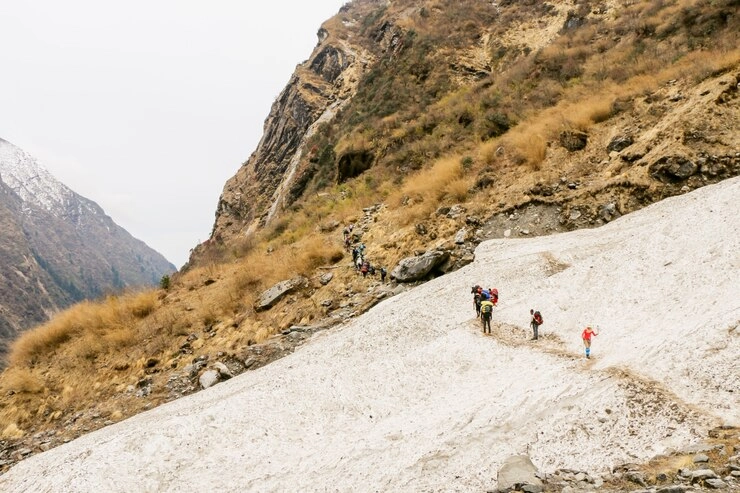

The trail grades will help you understand what sort of hike you are looking at, providing the information necessary to choose the perfect tour. Keep in mind that the grades are a reference and somewhat subjective!

Montaraz Outdoors & Culture catalogs activities according to the necessary physical preparation and technical difficulty. Knowledge and handling of specific techniques and materials for guided activities are not required. If this is your first activity with Montaraz Outdoors & Culture and you have doubts about your level, we recommend that you contact us to help you make your choice.

The physical preparation is mainly based on the distance and accumulated positive ascent and is closely linked with the terrain of the trail.

The technical difficulty depends on the hiking trail type and its characteristics. The hiking trail types are:

- Hiking Trails are typically under 2.000m and are the easiest trail grade. The trails are usually better marked with smoother terrain levels for walking. The different surfaces have minor risks, small obstacles, and less steep sections.

- Mountain Hiking Trails are typically found between 2.000-3.000 m. The paths
are not always clearly marked with more difficult terrain to walk. The trails have bigger obstacles and can be exposed with ropes or chains to assist, boulder crossings in sections, more exposed areas, and steep sections.

- Alpine Trails are typically found above 3.000 m and are more challenging. The trails have unmarked sections and the terrain is mostly exposed - rocky slopes, delicate steps, or glacier passages.

## Physical Difficulty

#### A . Inittiation

- This is an initiation level for people who do not do physical exercise daily (normal physical fitness). It is ideal for those who are beginning to practice hiking.

- The routes are of little difficulty, at a gentle pace, without enormous effort. The distances are less than or close to 10 kilometers and up to 350 meters of elevation gain. The hiking trails are typically found under 2.000 m. Hiking boots and walking sticks are recommended.

#### B . Basic

- Physical fitness: normal, with the habit of walking.

- Route distance of approximately 15 km.

- Accumulated positive ascent of the route: approximately 600 m.

- Duration trail: approximately 6 hours

#### C . Moderate

- Physical fitness: Good, with the habit of doing aerobic sports.

- Route distance of approximately 20 km.

- Accumulated positive ascent of the route: approximately 1.000 m.

- Duration trail: approximately 8 hours.

#### D . Challenging

- Physical fitness: Very good.

- Route distance of approximately 25 km or more

- Accumulated positive ascent of the route: approximately 1.500 m. or more

- Duration trail: more than 8 hours

#### E . Alpine Trail Challenging

- Physical fitness: Very good.

- Hiking at altitudes over 3.000 meters

- A doctor's release may be required for ascents up to 4.000 meters

## Techinal Difficulty

#### A .

- Previous mountain hiking experience: not required.

- Trail type: Hiking trail

- Terrain: Trails are typically found under 2.000 m. The paths are well-marked and, are relatively comfortable without difficulties.

- Material: Basic hiking gear is required. Good hiking boots and walking sticks are recommended.

#### B .

- Previous mountain hiking experience: recommended.

- Trail type: Mountain Hiking Trail

- Terrain: The trails are typically between 2.000-3.000 m and are more difficult. The paths can be exposed with ropes or chains to assist and the terrain can be steep with boulder crossings in sections.

- Material: Proper hiking equipment is required. Walking sticks are recommended, and ankle-high hiking boots are strongly recommended.

#### C .

- Previous mountain hiking experience: necessary.

- Trail type: Alpine Trail.

- Terrain: The trails are typically found above 3.000 m and are more challenging. The paths are not always clearly marked and the terrain is mostly exposed - rocky slopes with steep ascents/descents, delicate steps, or glacier passages.

- Material: Proper hiking equipment is required. Walking sticks are recommended. Ankle-high hiking boots are required.

- A doctor's release may be required for ascents up to 4.000 meters.

