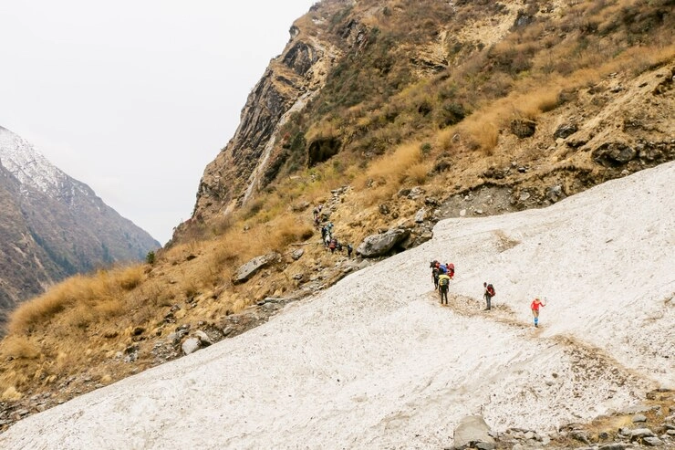

The trail grades will help you understand what sort of hike you are looking at, providing the information necessary to choose the perfect tour. Keep in mind that the grades are a reference and somewhat subjective!

Montaraz Outdoors & Culture catalogs activities according to the necessary physical preparation and technical difficulty. Knowledge and handling of specific techniques and materials for guided activities are not required. If this is your first activity with Montaraz Outdoors & Culture and you have doubts about your level, we recommend that you contact us to help you make your choice.

The physical preparation is mainly based on the distance and accumulated positive ascent and is closely linked with the terrain of the trail.

## Hiking grades

The trail grades will help you understand what sort of hike you are looking at, providing the information necessary to choose the perfect tour. Keep in mind that the grades are a reference and somewhat subjective!

Montaraz Outdoors & Culture catalogs activities according to the necessary physical preparation and technical difficulty. Knowledge and handling of specific techniques and materials for guided activities are not required. If this is your first activity with Montaraz Outdoors & Culture and you have doubts about your level, we recommend that you contact us to help you make your choice.

The physical preparation is mainly based on the distance and accumulated positive ascent and is closely linked with the terrain of the trail.

### 🟢 Initiation

This is a level for people who do not do physical exercise daily (normal physical fitness). It is ideal for those who are beginning to practice hiking. The routes are of little difficulty, at a gentle pace, without enormous effort. The distances are approx. 6 kilometers and up to 150 meters of elevation gain.

* **Terrain:** Mostly flat or gently sloping, well-marked and maintained paths
* **Requirements:** Suitable for beginners, families with children, or anyone looking for a relaxed nature walk.
* **Notes:** Perfect for first-time hikers or a short outing to enjoy the scenery.

## 🟡 Level 1 – Basic

* **Distance:** approx. 10 km
* **Elevation gain:** Up to 300 m
* **Terrain:** Gently rolling paths, occasional uneven sections
* **Requirements:** Basic fitness and comfortable walking for 3 hours
* **Notes:** Ideal for casual walkers who enjoy a bit more distance but without major effort.

## 🟠 Level 2 – Moderate

* **Distance:** 8–15 km
* **Elevation gain:** 300–600 m
* **Terrain:** Mix of easy and more rugged paths, some steeper sections or loose ground
* **Requirements:** Good fitness level, previous hiking experience recommended
* **Notes:** Expect 3–5 hours of walking with some moderate climbs.
* **Physical fitness:** with the habit of doing aerobic sports.

## 🔴 Level 3 – Advanced

* **Distance:** 12 – 20+ km
* **Elevation gain:** 600 – 1,000 m+
* **Terrain:** Hilly or mountainous, may include rocky trails, exposed sections, or uneven footing and boulder crossings in sections.
* **Requirements:** High level of fitness, confident on varied terrain, appropriate footwear essential
* **Notes:** For experienced hikers who enjoy longer days and elevation changes.
* **Material:** Proper hiking equipment is required. Walking sticks are recommended. Ankle-high hiking boots are required.

## ⚫ Level 4 – Difficult/Advanced

* **Distance:** 15–25+ km
* **Elevation gain:** 1,000 m or more
* **Terrain:** Mountainous, possibly technical sections (e.g. scrambling, narrow ridges), remote areas. The paths are not always clearly marked and the terrain is mostly exposed - rocky slopes with steep ascents/descents, delicate steps, or glacier passages.
* **Requirements:** Very good fitness, strong hiking experience, ability to manage long or exposed routes
* **Notes:** For experienced hikers who enjoy longer days and elevation changes.
* **Material:** Proper hiking equipment is required. Walking sticks are recommended. Ankle-high hiking boots are required.

 
 

