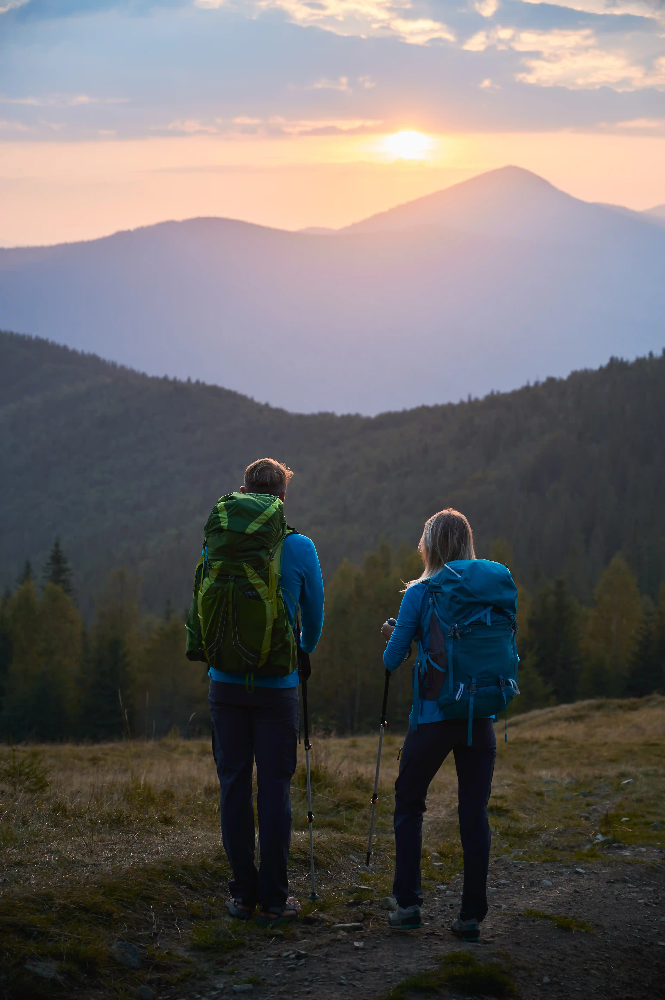
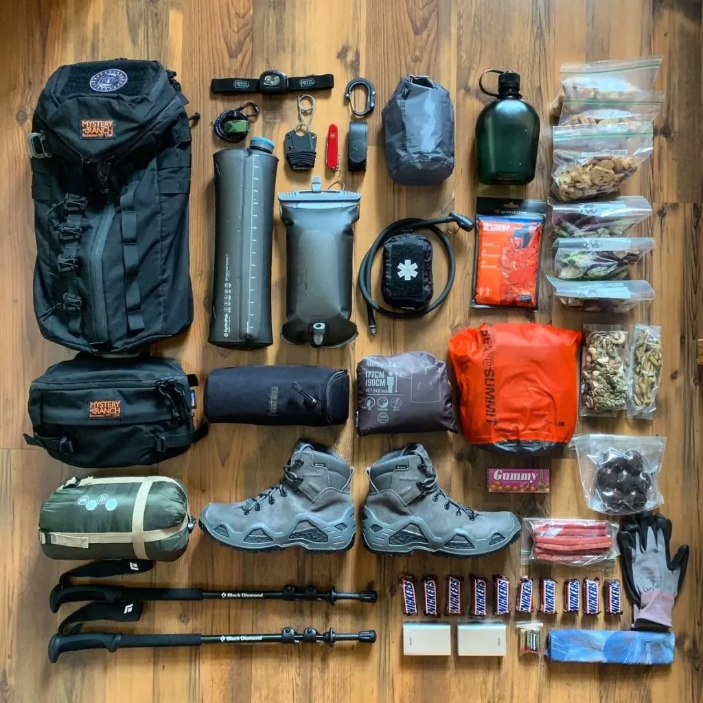
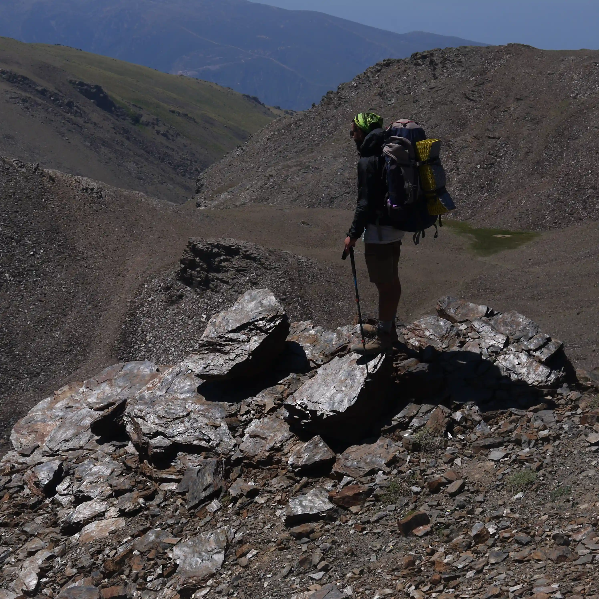

The right gear is essential for your safety and to make the experience enjoyable.

Either overpacking or underpacking can affect your trail experience therefore your pack should include only the essentials.

The essential equipment doesn`t vary much, but the time, distance, difficulty, and conditions of your hike will make a difference in the choice of gear and clothing you will want to pack.

### We divide the necessary equipment into two parts

- Clothing
- Equipment

### 1. Protecting our body, from head to toe, is essential

Your choice of clothing is very important, both in the clothing that you wear and the clothing that you pack. The conditions that you hike in will influence your clothing choices.

- A good pair of shoes: suited to your hiking terrain and fitness level.
- The three-layer system helps you choose the right clothes while taking into account the weather conditions and the sport practiced. Three layers of clothing will keep you dry and warm: a base layer for removing moisture, a mid-layer to keep you warm, and an outer layer to protect you from the elements. (For more information: check the article “three-layer system” in our blog.
- Breathable hiking T-shirts
- Quick-drying hiking pants or hiking shorts
- Polar fleece mid-layer or softshell jacket
- Socks: good quality walking socks are essential for your comfort and important for avoiding rubbing and blisters
- Breathable underwear made from synthetic fibers or merino wool. A comfortable sports bra for women.
- A windbreaker/waterproof jacket
- Waterproof over-pants
- Cap, sun hat, bandana, or beanie depending on the weather and what you are used to wearing.
- Neck
- Gloves

### 2. Equipment

- A hiking backpack. For day trips, aim for a packing volume between 20L and 35L max. Depending on the distance you’re planning to cover on your hike, weight, and comfort should be more of a priority when choosing a backpack. For day trips that tend to require only a little equipment or gear, a lightweight backpack without a frame is usually sufficient. If you’re out for longer trips or need to carry some heavy gear, a hiking backpack with an integrated metal frame will help distribute the weight evenly across your body.
- Waterproof Rain cover backpack. Even if your backpack is made out of water-repellent materials, it may be worth considering adding an extra layer of protection with a rain cover.
- Items to protect you from the sun: sunglasses, cap, sunscreen.
- Even if you haven’t got an overnight stay planned, you should always take a headlight with you. Don’t forget the extra batteries!
- First aid supplies. First aid kit, emergency blanket, a knife, a charged cellphone with emergency contacts saved, cash.
- Identity documents and numbers of all the people to call in case of an accident plus information about any medical conditions you have or medication you are on. This information could be really useful in case of an accident.
- Trekking poles (Recommended)
- Please keep our hiking paths clean. Carry a small bag to take your litter and any litter you find home with you.
- Food and water
- Toilet paper
- Navigation tools

Whether you are going for a short hike or an exposed trek, avoid going alone and share your itinerary with at least one person. These simple precautions could turn out to be very important in unexpected circumstances.

Any questions about the material’s recommendations for any of our activities, please contact us.
