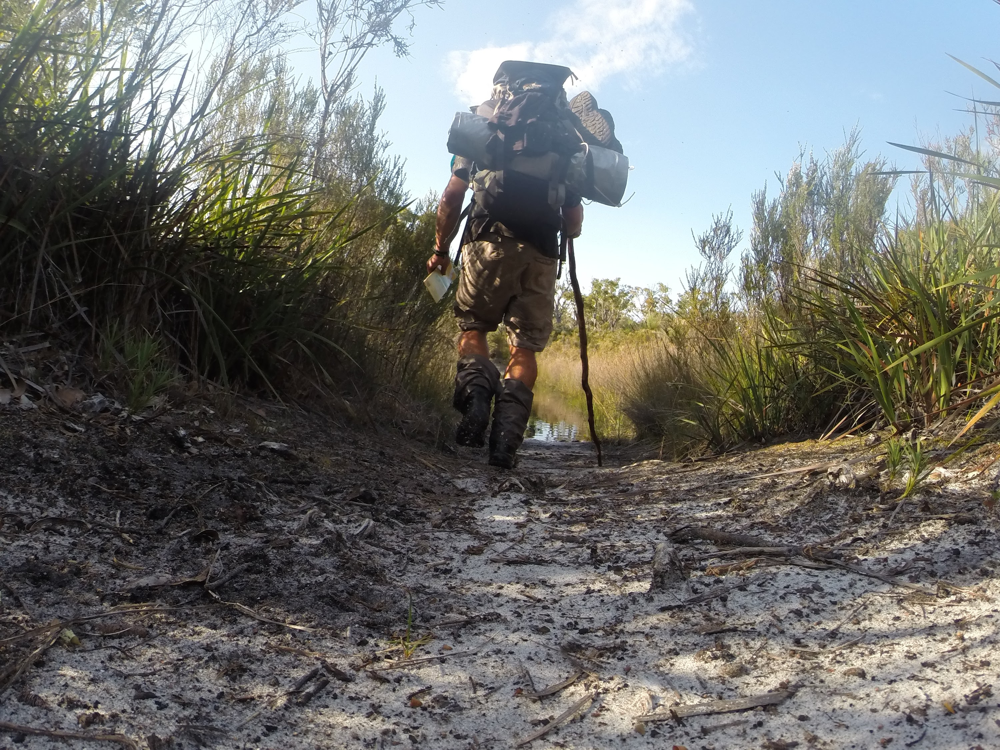
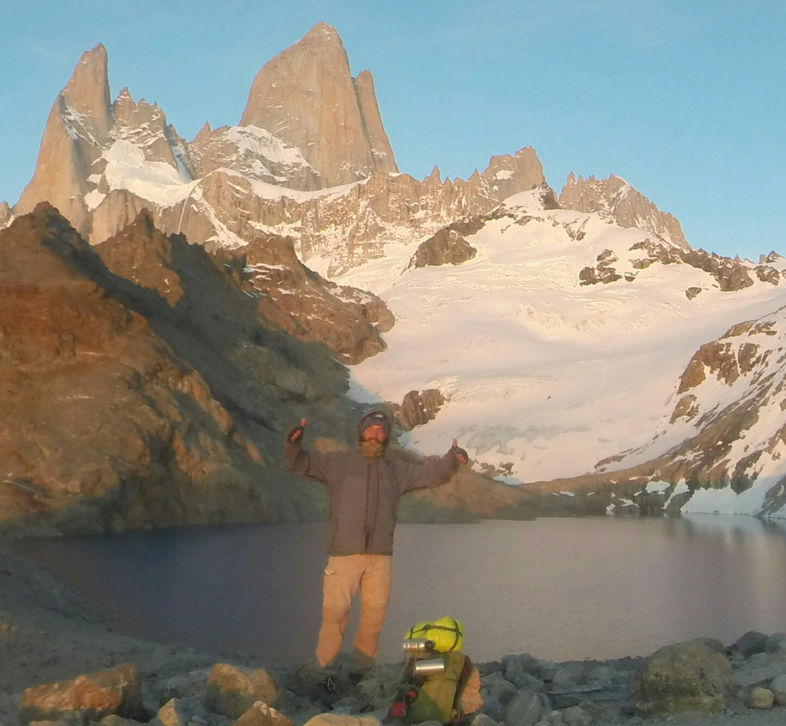
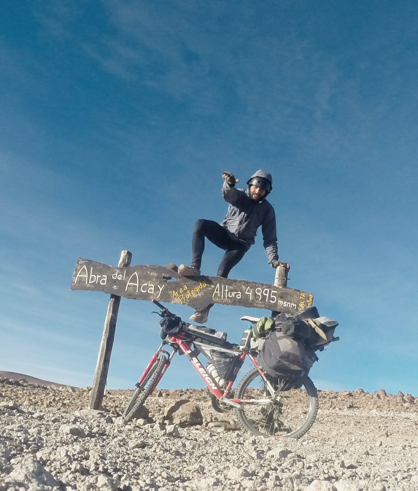
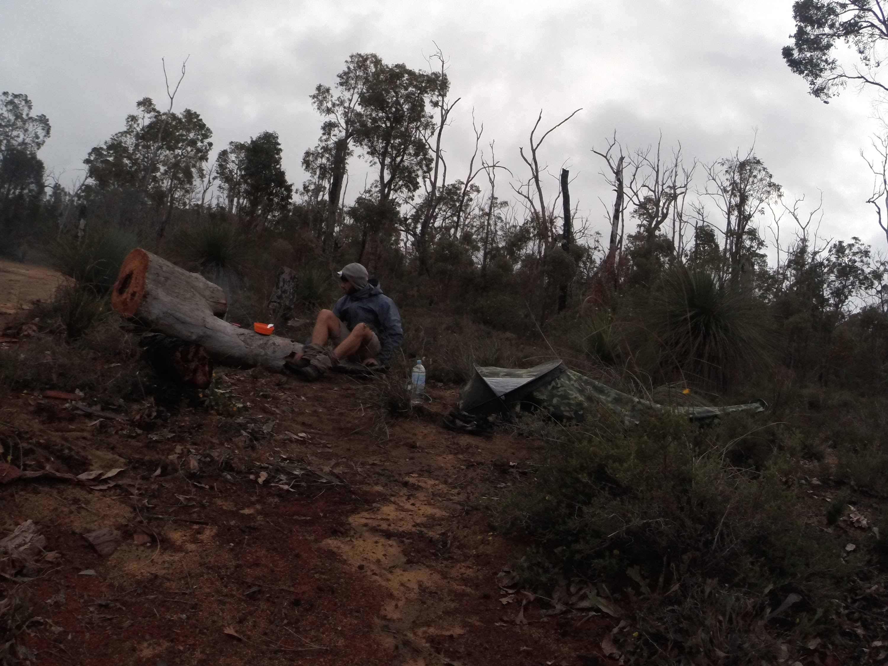

>**At a young age, I began traveling the world. Since then, my life has been a voyage of discovery**

I left home at a young age to find my true self, where I underwent a long journey of shadows and lights, an unknown winding road that has turned into ten years of travel.

Due to a turbulent childhood, the reality of independent travel to discover myself, reflect on what I want to achieve and learn, my core principles and potential hit me hard. It was also the exact moment when I realized just how important it was to undergo the journey of a life-changing opportunity.

The voyage allowed me to discover new skills, interests, passions, and values in life, and to grow as a person. It has enriched my mind and heart by exploring a big part of the beauty and diversity of the world. Experience discomfort and stepping out of my comfort zone have inspired and educated me on what made me more curious about everything.

I wanted to experience what it is like to live in a different culture and see how people in different parts of the world live to get a better understanding which gave me authentic experiences. Looking for jobs was a part of my new lifestyle to keep me going during my adventures. I can tell that I have done a lot of different jobs from construction work, bartender, farmwork, and teaching to volunteer work are only a few to mention which were life experiences.

Spending time in the outdoors and natural environment was essential during my long journey. At a young age, the outdoors already captured my attention and made me more interested in discovering different parts of the world by taking on adventure projects and pushing myself to the limit.

Long-distance hikes, living on a bicycle, mountain trekking, camping, bikepacking, climbing, etc. are today my adventurous stories.

I still pursue my passion and interest in the great outdoors which shows the best version of myself.

>**As a result of this adventurous lifestyle, I have turned my passion into a profession and founded the company Montaraz Outdoors and Culture**.

Michael Hugo,

